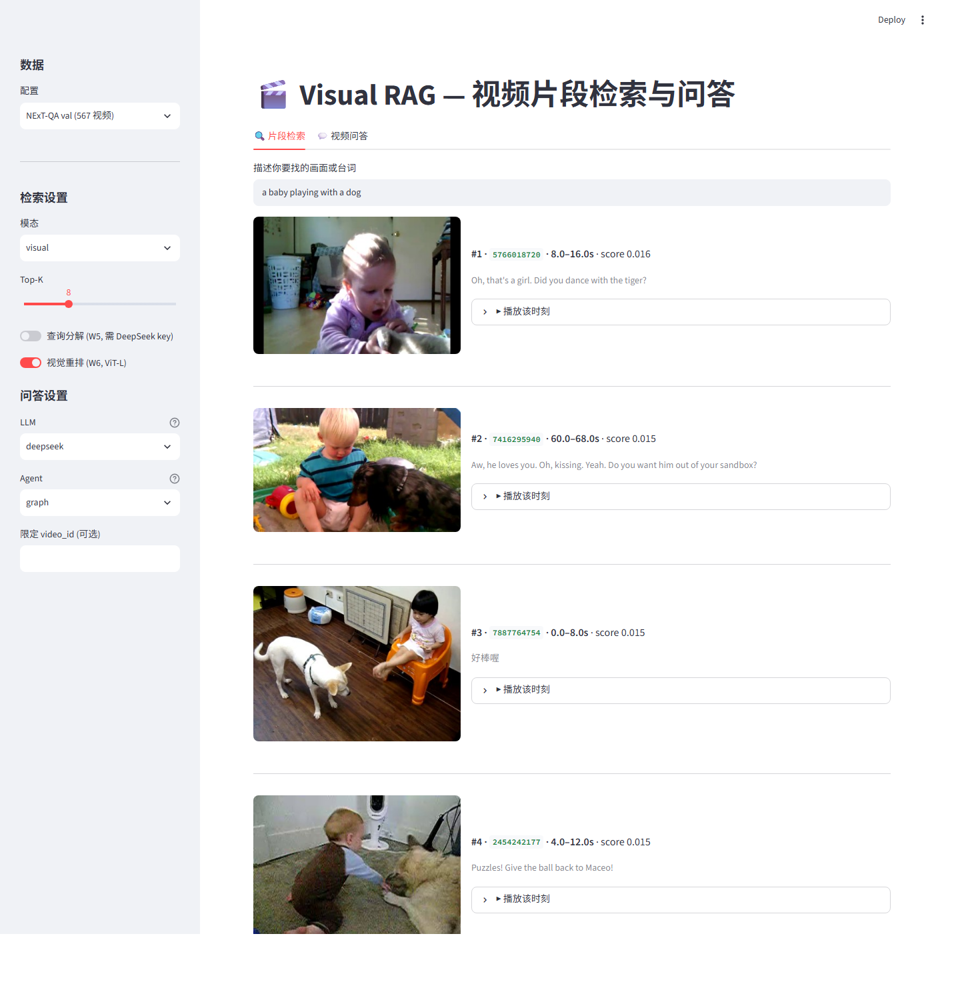

# Chapter 3 — System Design

This chapter describes the design of the Visual RAG system and, for each
component, the reasoning behind its design choices. The architecture was shaped
by one deliberate constraint and one methodological commitment. The constraint is
that the online system must run on consumer hardware (a 6 GB laptop GPU): all
heavy computation is pushed into a one-time offline indexing stage, and the
per-query path touches only a text encoder, an approximate-nearest-neighbour
index, and an LLM API. The commitment is that every retrieval component should be
*independently measurable*: modalities are indexed separately, pipeline stages
are toggleable, and each addition of Chapters 4–5 (decomposition, re-ranking,
temporal tools, reflection) can be switched on and off without touching the rest.
This is what makes the ablation programme of Chapter 5 possible, and several
design choices below are justified primarily by it.

## 3.1 Architecture overview

Figure 3.1 (fig1_pipeline) shows the system's two lanes. The **offline lane**
ingests a video corpus and produces a portable index: keyframes and timestamped
transcripts are extracted per video, fused into overlapping temporal segments,
embedded into a joint vision-language space, and stored in a vector database.
The **online lane** serves a natural-language query: the query is (optionally)
decomposed into retrieval-friendly sub-queries, encoded, searched against the
index, (optionally) re-ranked by a stronger visual model, and the resulting
segments — timestamps, transcripts, and keyframes — are handed as evidence to an
answering agent that produces a grounded response with per-claim timestamp
citations.

{#fig:pipeline width=95%}

The offline/online split is more than an engineering convenience. It makes the
expensive artefacts *reusable and portable* — the index of 567 videos is a few
hundred megabytes that can be computed once on any GPU and copied anywhere — and
it makes the research loop fast: every experiment in Chapter 5 re-uses the same
frozen ingestion outputs, so a full retrieval evaluation over 3,358 questions
runs in minutes on a laptop. The split also mirrors production video-search
architectures, where indexing throughput and query latency are separate budgets.

## 3.2 Ingestion and temporal segmentation

**Keyframes.** Each video is decoded once and sampled by two complementary
strategies: shot-boundary detection (PySceneDetect's adaptive detector)
contributes a representative frame per scene change, and uniform sampling at
0.5 fps guarantees coverage of long static shots that trigger no boundary.
Timestamps are de-duplicated with a minimum 1 s gap and capped at 64 frames per
video (an even subsample if exceeded); frames are stored as JPEGs resized to
384 px on the long side. The dual strategy reflects the two failure modes of
either alone: scene detection under-samples static footage, uniform sampling
misses brief transitions.

**Speech.** Audio is transcribed by Whisper large-v3 in int8 quantisation via
CTranslate2, yielding sentence-level chunks with start/end timestamps. Two
robustness details matter in practice. First, videos without an audio stream are
detected up front and skipped rather than crashing the batch — a real failure
mode discovered with silent test clips. Second, language is auto-detected per
video and *not* forced to English: NExT-QA's home videos are multilingual, and
transcribing them faithfully (rather than mistranscribing them as English)
preserves the option of translate-then-embed pipelines later, at the cost of the
encoder mismatch analysed in §5.2. On-screen-text OCR is implemented but
disabled by default: benchmark footage carries almost no legible text, and the
modality can be enabled by configuration where it earns its cost.

**Temporal segmentation.** The atomic unit of retrieval is the *segment*: an
8-second window advanced with a 4-second stride, carrying every keyframe whose
timestamp falls inside it, the concatenated transcript chunks that overlap it,
and its exact [start, end] interval. Windows with neither a frame nor text are
dropped; the 567-video corpus yields 5,725 segments. Three considerations fix
these numbers. The window must be short enough that "retrieving the segment"
constitutes a temporally precise answer — 8 s against a mean video length of
44 s gives roughly a five-fold refinement over whole-video retrieval, and is the
right order of magnitude for NExT-GQA's ground-truth moments. The 50% overlap
ensures that an event near a window boundary appears *whole* in at least one
window, at the cost of near-duplicate retrieval results (adjacent overlapping
windows frequently co-occur in top ranks, a benign redundancy observed
throughout Chapter 5). And fixed windows — as opposed to shot-aligned or
content-adaptive ones — keep the ground-truth-to-segment mapping simple and the
tIoU ceiling analysable (§6.2). Segment records are persisted as per-video JSONL
and are the single interface between ingestion and everything downstream.

## 3.3 Embedding and dual-modality indexing

Each segment receives up to two vectors in a joint vision-language embedding
space. The **visual vector** is the mean of its keyframes' L2-normalised image
embeddings, re-normalised — mean-pooling being the standard, hyperparameter-free
aggregation that preserves the cosine geometry. The **text vector** embeds the
segment's transcript (plus OCR when enabled) with the *same* model's text
encoder. Using one joint space for both modalities is what allows a single
encoded query to search either collection; the trade-off, accepted knowingly, is
that a contrastive text encoder trained on alt-text is a weak reader of long or
non-English transcripts (its 77-token context truncates long passages), which
Chapter 5 quantifies.

The encoder itself sits behind a thin interface (open_clip) so that the backbone
is a configuration value: ViT-B-32 for development, ViT-L-14 and SigLIP SO400M
for the Chapter 5 ablations. Every backbone's segment embeddings are cached as
per-video arrays on disk, making a backbone swap a one-time re-embedding job and
an index rebuild a matter of minutes — the property that made the W8 backbone
comparison affordable.

Vectors live in ChromaDB — an embedded vector store chosen over server-class
alternatives (Milvus, Qdrant) because at 10³–10⁴ segments HNSW search is
effectively exact and operational simplicity dominates. The two modalities are
stored as **separate collections** sharing segment IDs and metadata
(`video_id`, `start`, `end`, frame count) rather than as one concatenated
vector. This is the single most consequential indexing decision: separate
collections mean each modality can be searched, scored, and evaluated in
isolation, which is precisely what RQ2's ablations require; late fusion,
early fusion, or either modality alone all become query-time choices over the
same index. Segment text rides along as the collection's document payload, so
downstream components (re-rankers, agents) can access it without re-reading
disk.

## 3.4 Retrieval

The retriever exposes one code path used identically by the evaluation harness,
the agent, and the demo UI — deliberately, so measured numbers describe the
system users interact with.

**Single-query search** encodes the query with the index backbone's text encoder
and performs cosine search in one modality, or in both with **late fusion**
(score = α·visual + (1−α)·text, candidates over-fetched threefold before
fusion). Late fusion was preferred over early (concatenation) fusion because it
requires no joint training, is trivially ablatable per modality, and exposes α
as an interpretable knob — the knob the α-sweep of §5.3.1 then showed to have no
useful setting on this corpus, itself a finding the design made cheap to obtain.

**Query decomposition** (W5) addresses the mismatch between causal/temporal
question phrasing and CLIP's training distribution of literal scene captions. An
LLM rewrites the question into at most four short present-tense captions; each
caption *plus the original question* is searched independently, and the
rankings are combined by reciprocal rank fusion (k = 60). Two design details are
load-bearing. Retaining the original question guarantees decomposition can only
add candidates, never replace the baseline behaviour — a safety property that
made it deployable by default. And rank-based fusion (rather than score
averaging) sidesteps the incomparability of cosine scores across differently
phrased sub-queries. Decompositions are cached on disk keyed by question text,
so the marginal cost across the 3,358-question evaluation was a one-off ~US$0.15.

**Second-stage re-ranking** (W6) re-scores a 30-candidate pool and re-orders it
by a weighted RRF of the first-stage ranking and the re-ranker's ranking. The
design went through one documented failure: the planned text cross-encoder
(question × transcript) *degraded* every metric, for reasons diagnosed in
§5.3.3, and survives only as an ablation configuration. Its replacement re-scores
candidates *visually*, with a stronger backbone (ViT-L-14) over pre-computed
segment embeddings — turning the re-ranker into a second opinion from a better
witness rather than a different modality. One methodological lesson from the
failure is baked into both re-rankers: when a candidate lacks the re-ranker's
modality (no transcript; no cached vector), its re-ranker rank is *imputed from
its retrieval rank* instead of being treated as absent, keeping all candidates
on one score scale. Without this, every candidate the re-ranker could score
would structurally outrank every candidate it could not — which in an early
implementation silently drove R@1 to zero.

## 3.5 Agentic answering

The answering layer converts retrieved segments into a natural-language answer
with per-claim citations of the form `[video_id @ start–end s]`. It is built as
native LLM function-calling over two tools, in two harnesses of increasing
sophistication.

**Tools.** `search_video_segments(query, modality)` wraps the retriever;
its description instructs the model to phrase queries as scene descriptions
rather than questions — pushing the decomposition insight into the agent's
tool-use behaviour. `get_segments_around(video_id, timestamp, direction, n)` is
the temporal primitive: it returns the segments immediately before or after a
timestamp in one video. Temporal questions ("what did X do *after* Y?") are
answered by composition — anchor Y with search, then walk `after` — a two-step
plan the system prompt states explicitly, and which the agents were observed to
follow (§5.4.1).

**Simple agent (W4).** A bounded tool-use loop: the model may call tools for up
to three rounds, after which a final call with tool choice disabled forces an
answer from the evidence gathered. The forced-answer step exists because both
LLM providers, left to themselves, will occasionally keep requesting searches
until the round budget expires and return an empty answer — an early bug whose
fix (an explicit "budget exhausted, answer now" turn) applies to both harnesses.

**Graph agent (W7).** The LangGraph state machine of Figure 3.2 (fig2_langgraph)
adds two things a linear loop cannot express cleanly. First, an explicit
**reflect node**: when the agent produces a draft answer, a separate LLM pass
audits it against the *actually gathered* evidence — do the cited segments exist
in the tool results? are the claims supported rather than invented? is the
temporal relation to the anchor correct? — and either accepts it (terminating
the graph) or returns it once with a critique appended, resuming the tool loop.
Reflection is bounded (one revision) and budget-aware: a revision is only
requested if enough tool rounds remain to act on the critique, a guard added
after observing budget-exhausted revision loops. Second, the graph makes the
control flow inspectable: every run yields a typed trace of rounds, tool calls,
and reflections, which Chapter 5 uses for its qualitative analysis.

{#fig:langgraph width=82%}

**Provider abstraction and the evidence channel.** Both agents run against
either an OpenAI-compatible endpoint (DeepSeek; any local server such as Ollama)
or the Anthropic API. The abstraction is not merely operational: the two
providers differ in the *evidence channel*. Under the multimodal provider, tool
results embed each segment's middle keyframe as an image block alongside its
transcript, capped at six images per result; under text-only providers the same
renderer emits transcript and timestamps only. Because the tools, prompts, and
retrieval are identical across providers, switching the provider is a controlled
manipulation of what evidence the answerer can perceive — the design property
that enables the evidence-channel experiment of §5.4.2 to be run as a true
single-variable comparison.

## 3.6 Demonstration interface

A Streamlit application exposes the full pipeline interactively in two tabs.
The *search* tab runs the retrieval stack with per-component toggles —
modality, query decomposition, visual re-ranking — and renders each hit with its
keyframe, timestamps, transcript, and score; expanding a hit plays the source
video seeked to the segment's start time, closing the loop from natural-language
query to the exact moment on screen. The *ask* tab runs either agent under
either provider and displays the answer alongside its full evidence trail (every
tool call and the segments it returned). The toggles map one-to-one onto the
ablation dimensions of Chapter 5; the interface therefore doubles as a research
instrument — the qualitative observations cited in Chapters 5 and 6 were made
through it — and as the project's demonstrable artefact.

{#fig:demo width=95%}

## 3.7 Summary

The design commits to cheap, measurable components over end-to-end training:
fixed overlapping segments as the unit of temporal grounding; one joint
embedding space with modalities indexed separately; retrieval improvements
(decomposition, re-ranking) that compose as pure query-time re-rankings; an
agent layer whose tools, control flow, and evidence channel are each
independently switchable. Chapter 4 details the implementation of these
components; Chapter 5 measures them.
